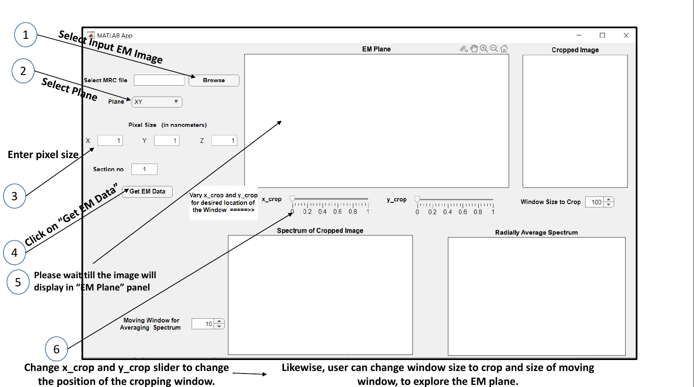

# Spectral Information Exploration Tool

## Overview

The **Spectral Information Exploration Tool** is a **MATLAB-based Graphical User Interface (GUI)** designed to facilitate interaction and exploration of spectral information within the 2D plane of Electron Microscopy (EM) images. The tool allows users to visualize, crop, and examine specific regions within the 2D planes of 3D EM images (compatible with MRC format), and explore the associated spectral information.

This tool is accessible as a MATLAB App, providing a convenient and interactive interface to analyze spectral data.

## Installation Instructions

1. **Download the Setup File**: Obtain the setup file for the tool from the source.
2. **Install the App**: 
   - Open MATLAB.
   - Navigate to the **Apps** section in MATLAB.
   - Click **Install App** and select the downloaded setup file to install the tool.

## Key Features

- **Visualize 2D Planes**: 
  - Easily visualize any desired 2D plane extracted from a 3D electron microscope image, with compatibility limited to the MRC file format.
  
- **Crop & Examine Specific Regions**: 
  - Select and crop specific regions within the 2D plane of the 3D EM image for a closer look.

- **Spectral Information Exploration**: 
  - Examine the spectral information associated with the selected region within the 2D plane, allowing you to explore various spectral properties.

- **Radial Average Spectrum**: 
  - Compute and explore the radial average spectrum derived from the cropped segment of the 2D plane, offering an insightful perspective on spatial frequency characteristics.
  
## Usage

1. **Open the App**: After installing the app, navigate to **Apps > Spectral Information Exploration Tool** in MATLAB.
2. **Select 2D Plane**: Choose the desired 2D slice or plane from your 3D EM image (MRC format).
3. **Crop Region**: Use the cropping tool to select specific regions of interest within the 2D plane.
4. **Examine Spectrum**: View the spectral information for the cropped region and analyze frequency distributions.
5. **Explore Radial Average Spectrum**: Compute the radial average spectrum for a deeper understanding of the spatial frequencies within the selected region.

## System Requirements

- **MATLAB Version**: Ensure you have MATLAB installed (version 2020a or later recommended).
- **File Format**: The tool is compatible with the MRC file format, a common format for storing EM image data.

## Contributions

If you'd like to contribute to this project, please fork the repository, create a new branch, and submit a pull request with your changes. All contributions are welcome!

## Contributors
Pratik Purohit, Partha Mitra (CSHL), Harald Hess (Janelis Research Campus, HHMI)

